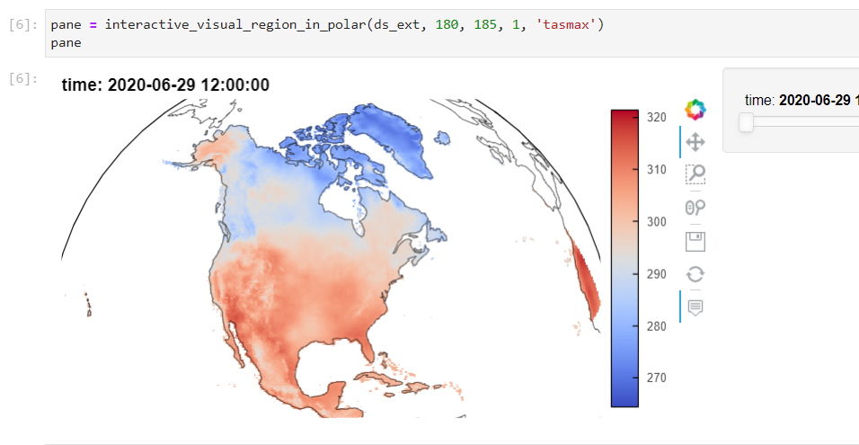
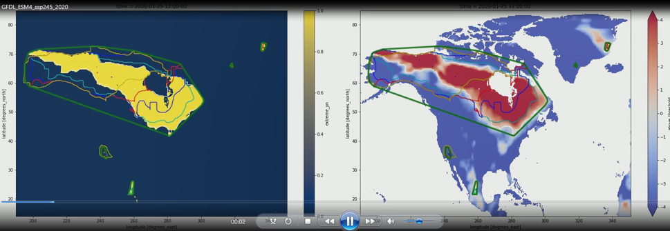

# heat-extremes-CMIP6
Using CMIP data (netCDF) files to identify and analyze extreme heat events like heatwaves and extreme cold days events.

Generating Contours on the areas identified as being under extreme temperature and analyzing the same.

Leveraging planetary computer environment through docker, to develop and execute code from the local machine. 

## Repository Contents
This repo includes: 
1) The code for identifying extreme temperature events. This includes:      
    - processing the CMIP files and produceing the heat waves / cold spells indentification data and generating results for each grid cell, for each day. If in extreme heat condition 'yes' or 'no' (1 or 0). Results are available in *xarray* format and saved as *netCDF* files.
    - visualizing results and analyses
    - generating images to be used for training of machine learning models.
    .

2) Code that makes use of the results from this package, the netcdf files of generated heatwave data, to capture the heatwave area shape contours and perfom analyses on those contours.
 
3) For those looking to use Microsoft Planetary Computer for their work and intend to use this package and/or other functionality on dask worker nodes -- a link to the description of using docker compose setup for the same.

### Sample visualizations
Visualize in an interactive plot - the maximum temperature:

Visualize contours -- and a video created by stitching together images of many days:

## Project Description

[NASA GISS provides configuration for generating coarse resolution climate simulation data](https://data.giss.nasa.gov/modelE/cmip6/) for 100+ years -- using [CMIP](https://esgf-node.llnl.gov/projects/cmip6/). For CMIP6, this includes data for historical years from 1950 to 2014 and for two different ssp scenarios, till year 2100.

That data is in NetCDF4 format and is available for variables that include
- *tasmax* : daily maximum temperature
- *tasmin* : daily minimum temperature

This project attempts to process this data and identify extreme heat events, over continuous days.

There are variations in definition of heatwave as can be seen from a few sources included here: [heat-wave-meteorology (World Meteorological Organization)](https://www.britannica.com/science/heat-wave-meteorology), [heat wave (American Meteorological Society)](https://glossary.ametsoc.org/wiki/Heat_wave) and [What Is a Heat Wave? (National Oceanic and Atmospheric Administration(NOAA))](https://scijinks.gov/heat/)

However, a broad definition like this should cover all the overlapping definitions of heat waves:
* temperature that is extreme due to being above the average temperature by the specified units (for example, 2 Kelvin above average)
* or, temperature that is extreme due to being above a certain threshold for that area (for example, above 100 degrees Fahrenheit)
* and when such extreme temperature continues over the specified number of days (*n*), could be 2, 3, 4, or more.

**identify_extreme_temperature**  
The code in this section provides for extreme temperature events to be identified for all the above mentioned combinations of definition criteria. User can provide, as parameters, the desired threshold and the number of continous days to consider. 

The results are produced as NetCDF4 files, for the specified region / area-of-interest.

**contour_visualization**  
Further, the contour_visualizations section uses the results from extreme temperature event identification, to generate contours of shapes of areas that are under the event. 

**developer-tooling**  
 Develop code locally with your own / shared custom planetary computer environemnt while utilizing planetary computes resources

## Project Context
This work has been initiated through a student's project in partnership between Harvard University Extension Studies, Microsoft, and NASA.

It is a part of the Capstone project (July-December 2021) of a students' team at Harvard Extension School, Harvard University, for their master's degree program in data science. 

NASA Goddard Institute for Space Studies (GISS; https://www.giss.nasa.gov/) is a laboratory in the Earth Sciences Division (ESD) of NASA's Goddard Space Flight Center (GSFC). Subject matter expertise and guidance has been provided by the scientific advisors from NASA GISS.

Microsoft intitiatives of [Project 15](https://docs.microsoft.com/en-us/azure/architecture/solution-ideas/articles/project-15-iot-sustainability) and [Plantery Computer](http://planetarycomputer.microsoft.com/) have been the technical partners providing a cloud based computing environment in Microsoft Azure and Microsoft Planetary Computer. 

The student team:
* Koray Kinik (koraykinik1984@gmail.com),
* Phillip Booth (phillip.booth2015@gmail.com), and
* Ravi Sharma (ravisharma111@gmail.com)  

