# heat-extremes-CMIP6
Using CMIP data (netCDF) files to identify and analyze extreme heat events like heatwaves and extreme cold days events.

Generating Contours on the areas identified as being under extreme temperature and analyzing the same.

Leveraging planetary computer environment through docker, to develop and execute code from the local machine. 

## Repository Contents
This repo includes: 
1) The code for identifying extreme temperature events. This includes:      
    - processing the CMIP files and produceing the heat waves / cold spells indentification data and generating results for each grid cell, for each day. If in extreme heat condition 'yes' or 'no' (1 or 0). Results are available in *xarray* format and saved as *netCDF* files.
    - visualizing results and analyses
    - generating images to be used for training of machine learning models.
    .

2) Code that makes use of the results from this package, the netcdf files of generated heatwave data, to capture the heatwave area shape contours and perfom analyses on those contours.
 
3) For those looking to use Microsoft Planetary Computer for their work and intend to use this package and/or other functionality on dask worker nodes -- a link to the description of using docker compose setup for the same.

### Sample visualizations
Visualize in an interactive plot - the maximum temperature:

Visualize contours -- and a video created by stitching together images of many days:

## Project Description

[NASA GISS provides configuration for generating coarse resolution climate simulation data](https://data.giss.nasa.gov/modelE/cmip6/) for 100+ years -- using [CMIP](https://esgf-node.llnl.gov/projects/cmip6/). For CMIP6, this includes data for historical years from 1950 to 2014 and for two different ssp scenarios, till year 2100.

That data is in NetCDF4 format and is available for variables that include
- *tasmax* : daily maximum temperature
- *tasmin* : daily minimum temperature

This project attempts to process this data and identify extreme heat events, over continuous days.

There are variations in definition of heatwave as can be seen from a few sources included here: [heat-wave-meteorology (World Meteorological Organization)](https://www.britannica.com/science/heat-wave-meteorology), [heat wave (American Meteorological Society)](https://glossary.ametsoc.org/wiki/Heat_wave) and [What Is a Heat Wave? (National Oceanic and Atmospheric Administration(NOAA))](https://scijinks.gov/heat/)

However, a broad definition like this should cover all the overlapping definitions of heat waves:
* temperature that is extreme due to being above the average temperature by the specified units (for example, 2 Kelvin above average)
* or, temperature that is extreme due to being above a certain threshold for that area (for example, above 100 degrees Fahrenheit)
* and when such extreme temperature continues over the specified number of days (*n*), could be 2, 3, 4, or more.

**identify_extreme_temperature**  
The code in this section provides for extreme temperature events to be identified for all the above mentioned combinations of definition criteria. User can provide, as parameters, the desired threshold and the number of continous days to consider. 

The results are produced as NetCDF4 files, for the specified region / area-of-interest.

**contour_visualization**  
Further, the contour_visualizations section uses the results from extreme temperature event identification, to generate contours of shapes of areas that are under the event. 

**developer-tooling**  
 Develop code locally with your own / shared custom planetary computer environemnt while utilizing planetary computes resources

## Project Context
This work has been initiated through a student's project in partnership between Harvard University Extension Studies, Microsoft, and NASA.

It is a part of the Capstone project (July-December 2021) of a students' team at Harvard Extension School, Harvard University, for their master's degree program in data science. 

NASA Goddard Institute for Space Studies (GISS; https://www.giss.nasa.gov/) is a laboratory in the Earth Sciences Division (ESD) of NASA's Goddard Space Flight Center (GSFC). Subject matter expertise and guidance has been provided by the scientific advisors from NASA GISS.

Microsoft intitiatives of [Project 15](https://docs.microsoft.com/en-us/azure/architecture/solution-ideas/articles/project-15-iot-sustainability) and [Plantery Computer](http://planetarycomputer.microsoft.com/) have been the technical partners providing a cloud based computing environment in Microsoft Azure and Microsoft Planetary Computer. 

The student team:
* Koray Kinik,
* Phillip Booth, and
* Ravi Sharma

# User Guide
As mentioned in the project description, this repository includes python source code for:
* Identifying Heat Extremes (heatwaves and extreme cold spells)  
* Visualizing and analyzing results  
* Generating Contours around heat-extreme shapes, on the data generated in previous steps  
* Use contours meta-data and visuals for further analyses  
* Dev tools for advanced use-case of using Planetary Compute dask cluster.  

## Suggested environment:
### Microsoft Planetary Computer
It is advisable but not mandatory to use [Microsoft Planetary Compute](https://planetarycomputer.microsoft.com/) environment for running the code. The advantage of using the Planetarty Compute is that the notebook environment already has almost all the required packages preinstalled.  

However, it is possible to run this code on a different notebook environment too, even on your local machine. You will have to make sure that the requisite packages are available. You may get error messages for the missing packages as you run the code. Those packages will need to be installed one-time.

### Microsoft Azure (Cloud Storage)
The solution produces various results in different files, many of large size (500 MB+). For reuse and sharing between teams, storing these files in cloud are preferable.

This code offers integration with [Azure](https://azure.microsoft.com/en-us/) cloud storage for seamless upload and download of files. You will have to provide the details of your own Azure cloud storage.

However, again, this integration is *optional*. User should be able to run the complete code using their local storage only.

## Getting Started:

The core results of the project are identified events of extreme temperature (heatwaves or cold spells). The source data come from the CMIP files that have the daily maximum and minimum temperature at coarse resolution for the 150 years. That includes historical data and data for the future.

The project then uses some techniques to analyze the identfied extreme temperature events.

### Code
Clone the repository or download contents.

### Jupyter Notebook Environment
To get started, you will be using the code from the directory named **identify_extreme_temperature**. 

Save (or, if in a cloud environment like Planetary compute, upload) all the included files to local environment where you will have your notebook.

1) In **Planetary Compute** start by clicking at root folder...
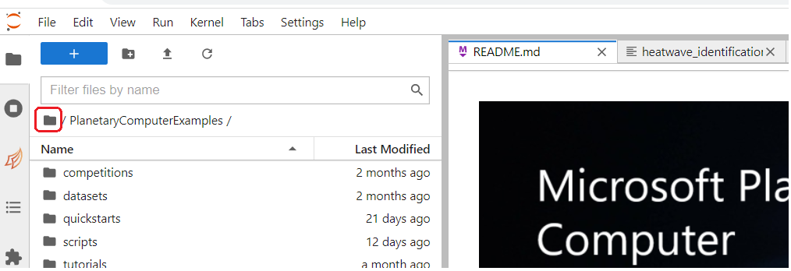

2) At the root, create a folder to put your code in...
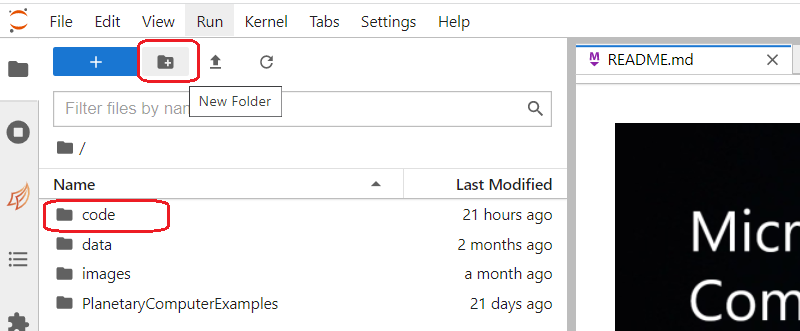

3) Once inside the new folder, use the upload button to upload each of the files found in github folder identify_extreme_temperature that you previously cloned or downloaded to a local folder...
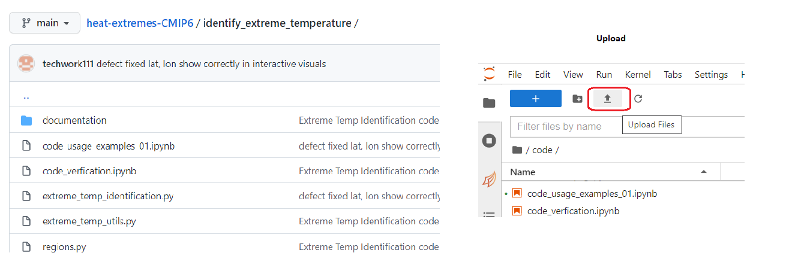

4) After uploading all the files from the identify_extreme_temperature folder, double-click to launch the notebook file 'code_usage_examples_01.ipynb'...
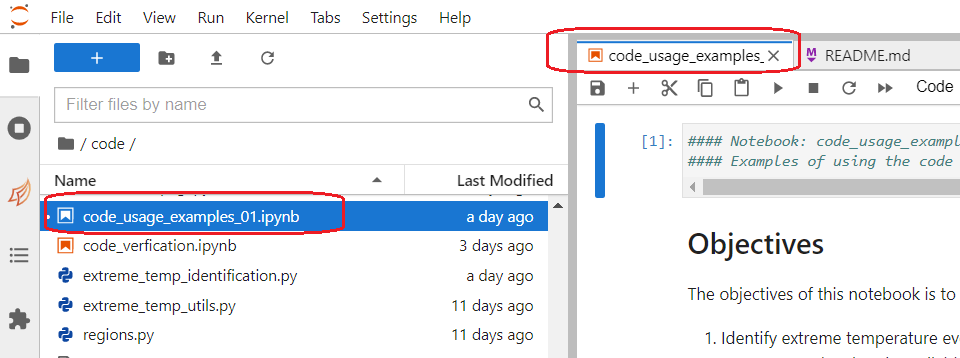

5) This notebook has the code examples to:
* generate heatwave data,
* visualize and analyze that data. 
Execute each code block in the file, refer to the descriptions, and observe the results.

See the section below for more notes on generating extreme temeperature identification resuls.

### Generating heatwave / extreme-temperature identification results:

As mentioned in the Project Description, there are slight difference is various definitions of a heatwave. The code in this project allows for the user to specify a criteria of their choice.

As such, the functionality of extreme temperature identification covers all the overlapping definitions of heat waves:
* temperature that is extreme due to being above the average temperature by the specified units (for example, 2 Kelvin above average)
* or, temperature that is extreme due to being above a certain threshold for that area (for example, above 100 degrees Fahrenheit)
* and when such extreme temperature continues over the specified number of days (*n*), could be 2, 3, 4, or more.

If you choose to use the average temperature in the criteria, you have to option to generate the average separately. That is, the average could come from the historical data of 30 or 50 years range, say from 1950 to 1979. The idenification of heatwave could then be done for the years 2020 to 2029, using the previously generated averages.

Please see the notebook 'code_usage_examples_01.ipynb' for example of generating heatwaves identification data and for visualizing the results.

## Optionally, using Azure for storage

The result files from various steps in the process of identifying and analyzing heat extremes can be voluminous. 

To store and reuse effectively, cloud storage is recommended. The code has built-in mechanism for seamlessly integrating with Azure cloud storage. You need to have your Azure portal access for this purpose. 

### Setting up storage in your Azrue Portal Account.

1) Sign in to your **Azure Portal** account and click on 'Resource Groups' option...
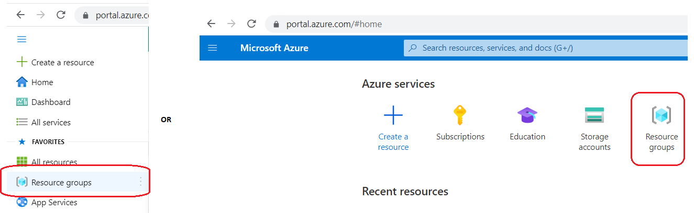

2) Here, we have created one named HES-NASA-MSFT based on our project setup...  
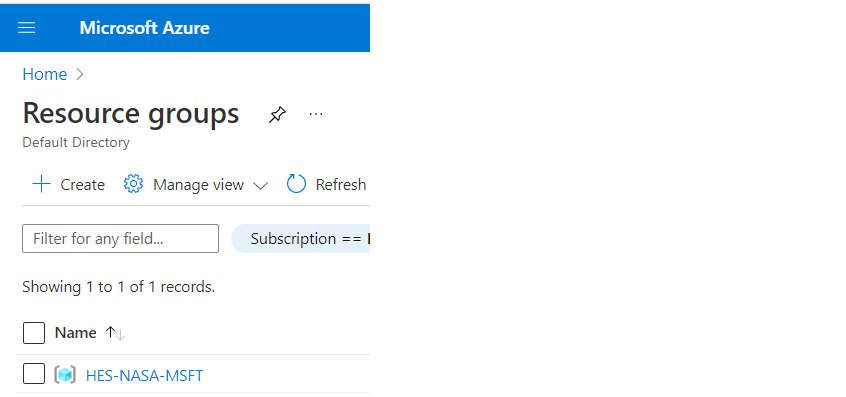

3) Now click on Storage Accounts...  
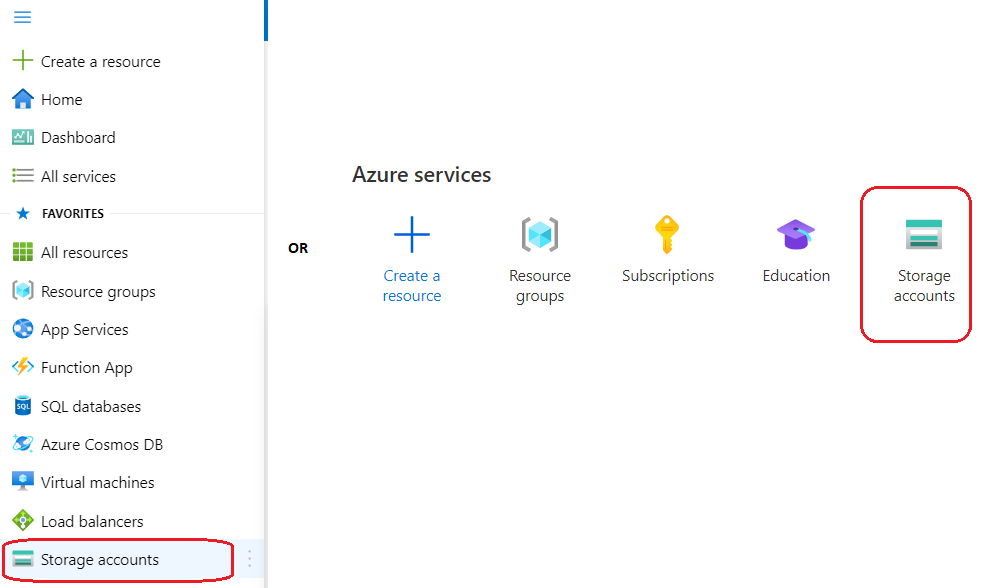

4) And Create a new Storage Account with the Resource Group from step 2. You will mostly go with default selections, HOWEVER, please remember to choose the low cost alternatives like 'Locally Reduntant Storage' or 'Geo Reduntant Storage' wherever such option is right for your requirements.  
Here, we have created one by the name nasanex30analysis...  
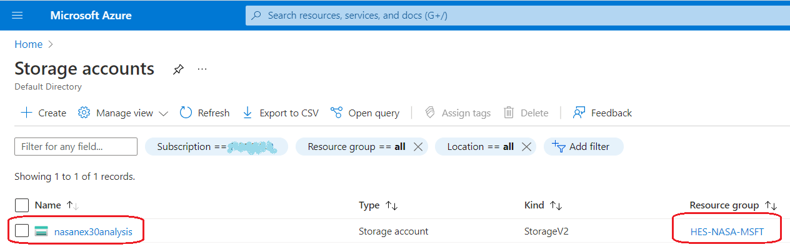

5) Next, go to your Storage Account, find the option 'Containers', and click on the option to create a new container ...  
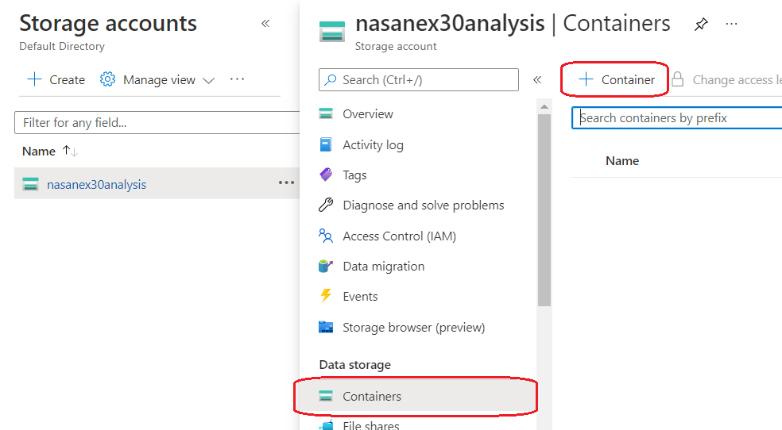

6) We created a container by the name 'cmip6', to hold the results from our work on CMIP6 source data files. Note that you can choose Private access or allow anonymous (anyone) read-only access to your container / blobs...  
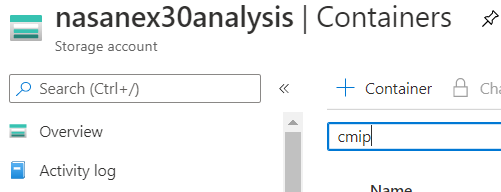

7) The folders you see in the container are created automatically by the code. However, to programmatically access this cloud storage container from our code, we need an access token. There are other Access Controls possible but the code is configured to best use 'Shared Access Tokens'. Click on that link everytime you start working with the code to generate a temporary secure access token for the specified number of hours/days...  
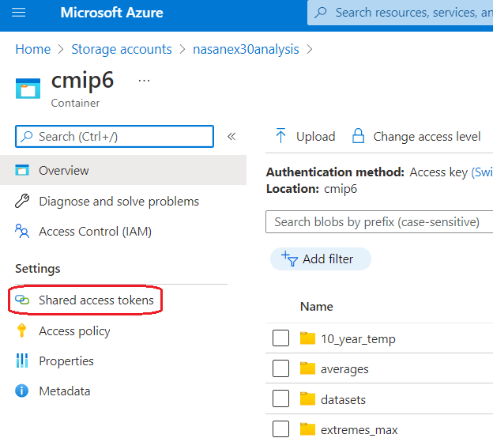

8) Most of the times, the code will need read and write access to the cloud storage, so from the 'shared access tokens' link, do select the options of Read, Add, Create, Write, Delete, and List ...  
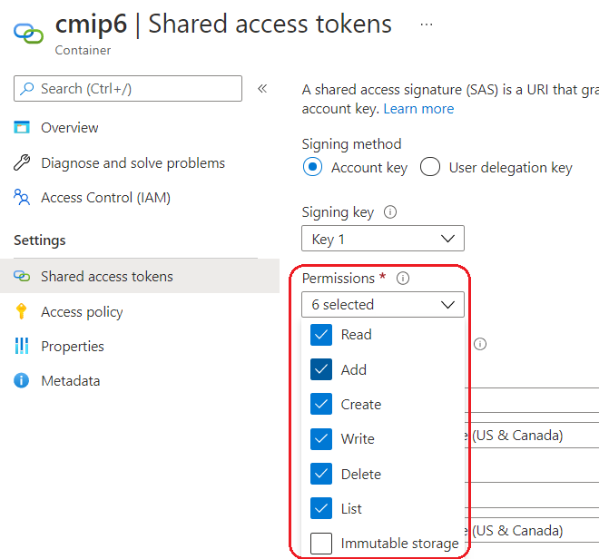

9) Also provide an expiry date and time, to specify the duration for which you will be working and would want the token to be active. This could be a few hours or a few days if you want to avoid repeating this step. However, for security purposes, it is advisable to generate the access token only for the duration you will be working in one session. Finally, click on 'Generate SAS token and URL' button...  
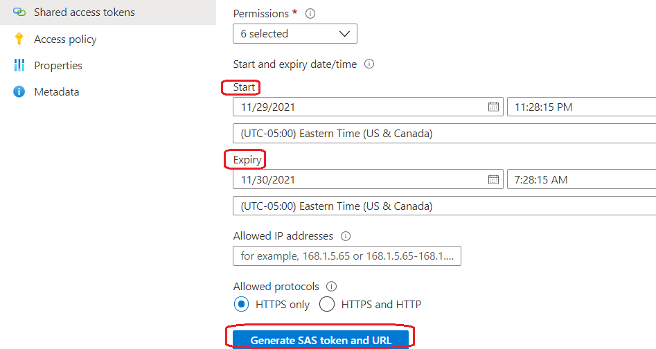

10) At this stage, you will be shown two new text boxes with a SAS Token and a SAS URL. One-by-one, use the copy icon on each of the text boxes and paste to a safe location. Keep it secure and paste the values to the apppopriate code blocks in your notebook before running those blocks ...  
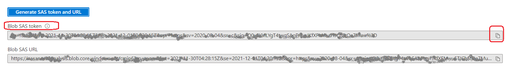
Here, we use the first value to paste as-is. The second value is used to determine the first part of the URL, till the container name.
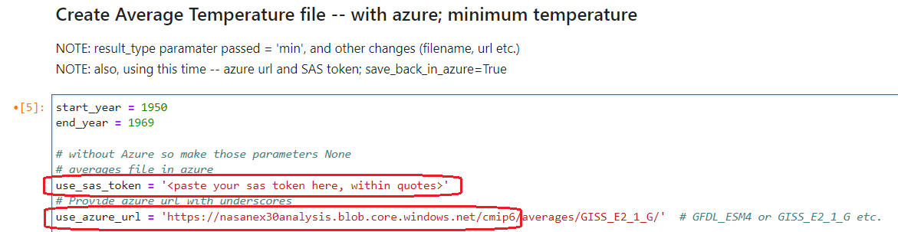

This is all you need to use Azure with your code. 

Again, remember that the use of Azure is optional. Please refer to the examples in the notebook to work with, or without, Azure.