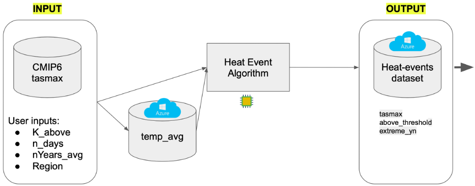
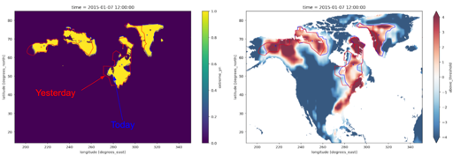

# Visualizing Heat-Extremes with **Contours**

In this module, we present one of many possible ways to leverage the heat-extremes 
dataset we produce using our pipeline which is in 
[identify_extreme_temperatures](https://github.com/KorayKinik/heat-extremes-CMIP6/tree/main/identify_extreme_temperature)
module. We will refer to this visualization tool as *Contours* algorithm. 
This is a data mining tool which extracts 
metadata from heat extreme events and produces visualizations. Figure below shows 
a simplified version of our heat-extremes pipeline, which produces the input 
for the Contours algorithm.



The end goal of the *Contours* algorithm was to track the progress of daily heat events and 
extract metadata which can help interpret the visualization we produce. Our approach was to 
use the computer vision package 
[OpenCV](https://opencv24-python-tutorials.readthedocs.io/en/latest/py_tutorials/py_setup/py_intro/py_intro.html#intro) ’s 
[findContours](https://docs.opencv.org/4.5.3/d3/dc0/group__imgproc__shape.html#gae4156f04053c44f886e387cff0ef6e08) 
function as the starting point. Each day sliced from our heat-events dataset 
includes a 2-dimensional binary array which we feed into `findContours`. 
This returns the contour(s) for a day and their positional hierarchy.

## How do we find `Contour`s?

In our implementation, a contour is a `numpy` array of `(i,j)` tuples describing an N-side 
polygon encircling an island of interconnected values of 1, in clockwise order. 
We obtain this result by applying OpenCV’s 
[morphologyEx](https://docs.opencv.org/4.5.3/d4/d86/group__imgproc__filter.html#ga67493776e3ad1a3df63883829375201f) 
transformation to define threshold on binary image.

For instance, Figure below shows a 644x284 pixel 2D slice for the day 2015-01-09 
from the dataset output produced from [CMIP6](https://data.giss.nasa.gov/modelE/), 
for inputs Region-1, 3days, 4°K difference. On the left is a 2D array with each pixel 
showing if the geolocation was a part of the heat event or not, labeled as 1 or 0, 
colored by yellow and purple, respectively.


**`kwargs`**

* `convex`: corrects convexity defects applying OpenCV’s 
[convexHull](https://docs.opencv.org/4.5.3/d3/dc0/group__imgproc__shape.html#ga014b28e56cb8854c0de4a211cb2be656) algorithm, 
* `smooth_ratio`: approximates the number of vertices using OpenCV’s 
[approxPolyDP](https://docs.opencv.org/4.5.3/d3/dc0/group__imgproc__shape.html#ga0012a5fdaea70b8a9970165d98722b4c) algorithm 
(a smaller value will return 
less approximation, hence a more-sided polygon, and vice versa) and, 
* `min_area`: filters out tiny contours with small areas, calculated using OpenCV’s 
[contourArea](https://docs.opencv.org/4.5.3/d3/dc0/group__imgproc__shape.html#ga2c759ed9f497d4a618048a2f56dc97f1) algorithm. 


## `Contour` operations

Contour objects also have methods to control how they interact with each other. 
More specifically, they are addable. Table below shows the three possible 
outcomes of the sum operator on two `Contour` objects. 


## Moving-window summaiton of `Contour`s

Next, if we apply the same function on each day of a dataset, we obtain a 
collection of independent Contours for each day. The result looks like in the column 
contours in **Table** below. Each `Contour` object is represented by a unique hash `id` and 
holds all attributes wrapped under the instance implicitly.
So far, no interaction between the Contours occurred. Then, we define a rolling window of `N` days, 
and aggregate using the `sum` function. This is analogous to the popular `pandas` operation which 
could be described by pseudo-code: `df.rolling(window=4).sum()`. We append the results to the 
data frame, where the column `rolling_append` holds the collections of `Contour` objects 
and `rolling_sum` holds their aggregated sums.


The minimum output count is 1 if a larger `Contour` swallowed all others 
(within the same window). And the maximum output count is `N` if a window 
contained `N` non-overlapping (distinct) Contours. Often, the outcome is 
between `1` and `N`. For example, Figure below shows the `Contour`s found for 
each day within a 4-day window in 2015.





In this example, we used heat-events data from inputs: 4days, 5°K above, 
Avg_years_1950-1979, climate model Ssp245, Region-1, days from Jan 6th to 9th, 2015. 
For each day the rolling window drops the `Contour`s from the tail and 
adds the next day’s `Contour`s.


Figure below shows our pipeline which takes as input the heat-events dataset 
(which was the output of our upstream heat-events pipeline). Its outputs are 

* metadata extracted from the Contours, 
* an image per each day, and 
* a video file that compiles all images. 


The pipeline processes the dataset 
(`.nc` format) and produces these artifacts, before it uploads all to 
Azure blob storage.


We added a serializer to convert the `Contour` objects to json format 
before uploading the results of the processed dataset to Azure. 
This was a straightforward implementation of exploding a data frame 
for each unique day and Contour and extracting the class attributes 
to new columns. This way anyone can import the meta data into `pandas`
without the need to access our source code. Figure below shows an 
example.


Second artifact is a collection of images, like the ones in Figure above. 
And finally, we used [OpenCV](https://opencv24-python-tutorials.readthedocs.io/en/latest/py_tutorials/py_setup/py_intro/py_intro.html#intro) 
’s [videoWriter](https://docs.opencv.org/3.4.15/dd/d9e/classcv_1_1VideoWriter.html) 
function to compile all images into a single video in MP4 format.

For example, the links below show the 10-year outputs from 2020-2030, 
for 4 different Coupled Model Intercomparison Project Phase 6 (CMIP6) data sets. 

Inputs (for all) are: temperature 4days and 5°K above, Avg_years_1950-1979, Region-1.

[GISS E2 1 G ssp585](https://cera-www.dkrz.de/WDCC/ui/cerasearch/cmip6?input=CMIP6.ScenarioMIP.NOAA-GFDL.GFDL-ESM4.ssp245)

[](https://youtu.be/hDs73QtHfv0)

[GISS E2 1 G ssp585](https://cera-www.dkrz.de/WDCC/ui/cerasearch/cmip6?input=CMIP6.C4MIP.NOAA-GFDL.GFDL-ESM4.esm-ssp585)

[](https://youtu.be/uSojwxGyWUQ)

[GISS E2 1 G ssp585](https://cera-www.dkrz.de/WDCC/ui/cerasearch/cmip6?input=CMIP6.ScenarioMIP.NASA-GISS.GISS-E2-1-G.ssp245)

[](https://youtu.be/PCutsAQ3biQ)

[GISS E2 1 G ssp585](https://cera-www.dkrz.de/WDCC/ui/cerasearch/cmip6?input=CMIP6.ScenarioMIP.NASA-GISS.GISS-E2-1-G.ssp585)

[](https://youtu.be/VCE3C2o_oB8)

## Clustering Contours based on their Shapes

In the following study, we focus on the shapes of the heat-extreme blobs, 
each defined by a `Contour` array. We aim to test the following hypothesis:

* do the shapes of the heat-extreme blobs form general patterns?
* can we meaningfully cluster the shapes of these blobs?
* can we assign a never-seen Contour to one of these pre-trained clusters?

We used an unsupervised approach because we do not have pre-labeled shapes 
to build a classifier. Instead, we examined if the contours will naturally 
form clusters based on their shapes on a reduced dimension space. 
Figure below shows our workflow.


First, we read the contours metadata and produce standard-size images in array format. 
Figure below shows sample images of contour shapes, resized to standard dimensions. 
Each image was created by converting the 1D contour array metadata to 2D image `numpy` array.


Second, using this data, we trained a 
[convolutional autoencoder](https://blog.keras.io/building-autoencoders-in-keras.html) 
below as a dimension reducer. 

```python
input = Input(shape=(img_height,img_width,1))

x = Conv2D(16, (3, 3), activation="relu", padding="same")(input)
x = MaxPooling2D((2, 2), padding="same")(x)
x = Dropout(0.5)(x)
x = Conv2D(16, (3, 3), activation="relu", padding="same")(x)
encoded = MaxPooling2D((2, 2), padding="same", name='encoded')(x)
encoder = Model(input, encoded)

x = Conv2DTranspose(16, (3, 3), strides=2, activation="relu", padding="same")(encoded)
x = Conv2DTranspose(16, (3, 3), strides=2, activation="relu", padding="same")(x)
decoded = Conv2D(1, (3, 3), activation="sigmoid", padding="same")(x)

autoencoder = Model(input, decoded)

autoencoder.compile(optimizer="adam", loss="mse")

history = autoencoder.fit(x_train, x_train, epochs=10, batch_size=32, verbose=True,)
```

Third, we used [UMAP](https://umap-learn.readthedocs.io/en/latest/) (Uniform Manifold Approximation and Projection) to 
perform non-linear transformation of the embeddings. And finally, we used 
[HDBScan](https://hdbscan.readthedocs.io/en/latest/how_hdbscan_works.html) algorithm to 
identify the clusters on the lower dimensional space. Figure below shows the UMAP transformed data, 
labelled by their HDBScan cluster assignments.


## Conclusion

With the Contours algorithm, we aimed to demonstrate how the heat events dataset 
produced by our upstream pipeline can be leveraged to enrich visualizations 
and to extract meta data such as the areal extend and epicenter of heat extreme 
blobs. Finally, a few practical use cases for this tool could be the following. 

For a set of input configurations, a user can:

* import the preprocessed meta data for a year and region, group Contours by day, 
filter by their type (daily, or rolling-summed), and sort by their impact area. 
* play the video and navigate directly to the date where a heat event of
particular interest took place. 
* inherit the Contour class from the source code and extend its methods to 
make Contour objects respond to more complex behavior.
* apply unsupervised learning methods, for instance, investigate 
underlying patterns of contour shapes.
