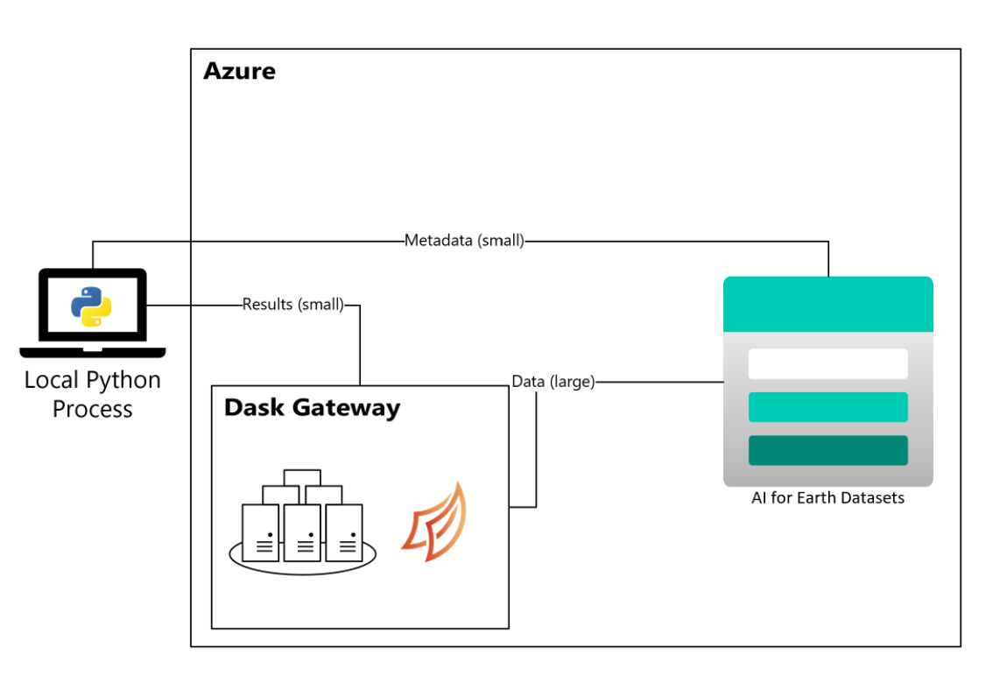

# Improved Local Development Utilizing Planetary Computer's Scalable Compute Resources


## Introduction


The developer tooling section of this repo is dedicated to improving the local development experience with Planetary Computer. The work inside of this section builds on top of the great work that has been completed by the Open Source pangeo-data team: https://github.com/pangeo-data/pangeo-docker-images#pangeo-docker-images

The developer-tooling section takes their exiting planetary-computer docker image and creates a wrapper around it that allows individuals to customize the image and have increased control over their local development experience.

### Architectural Diagram



The architectural diagram is from the planetary computer website. https://planetarycomputer.microsoft.com/docs/concepts/computing/ and displays what a local devlopment environemnt consists of. As a developer you are running code found locally on your machine, but accessing Planetary Computer's computational resources to allow your code to run much faster.


This provides many benefits, but the out of the box behavior can be limiting in that you are not in control of the libraries that end up in your Dask cluster. You can view them, and you can manually install them on the workers if you have high proficiency with Dask, but each person working locally will need to perform these exact same steps in order to work in parallel.


This tooling provides automated creation of a new, custom Docker image built from the existing mcr.microsoft.com/planetary-computer/python:latest image that allows for custom library integration. Whether you are looking to install publically available Python libraries or integrate some local libraries from your file system this tooling will give you the flexibility to do so.


### The benefits of this tooling are:

- Ability to easily configure the workers on your dask cluster with the libraries you need.
- Provide an easily reproducible development  environment that can be shared across your team.
- Develop your own libraries on the fly and integrate them into your Planetary Compoter development process.
- Automatic integration with source control since you are working wiht local files.


## Steps to run


1. Configure the buildtools.sh file with your relevant docker information.

   

   The naming of your generated  planetary computer hub image are configured by you. Whether you are working locally, or share an accout with your team you can configure the naming of your image to suit your needs.

   ```
   # Configurable Properties for perosnal development environment
   DOCKER_REPOSITORY=pbooth01
   DOCKER_IMAGE_NAME=pb-hub
   BASE_HUB_IMAGE_TAG=1.0.0
   ```

   Update the environment extension file noteebook-env-extension.yml with any desired additional packages that are not already a part of Planetary Computer out of the box.

   ```
   channels:
     - conda-forge
     - defaults
   dependencies:
     - dill
   ```


1. Run the build_and_push.sh script 

   

   This will use the available Dockerfile to build your custom planetary computer Docker image and push it to the configured docker repository to make it available for use by Dask workers.

   

   ```
   FROM mcr.microsoft.com/planetary-computer/python:latest
   
   # NB_USER is an owner of the filesystem so installs must be performed
   # by this user.
   RUN echo "Running as ${NB_USER} user..."
   
   # Inject welcome file into image to greet users upon startup
   ADD --chown=${NB_USER} welcome.txt /scratch/welcome.txt
   
   # Add environment extension configuration file into Image for including any additional packages into notebook environment
   ADD --chown=${NB_USER} notebook-env-extension.yml /env-extension/notebook-env-extension.yml
   
   # Use Conda to install any environment extensions into Conda notebook environment
   # So it becomes available on Dask workers.
   RUN conda env update -n notebook --file /env-extension/notebook-env-extension.yml
   
   # Inject the dev_concept library src code into the planetary compute image
   ADD --chown=${NB_USER} dev_concept /app/dev_concept
   
   WORKDIR /app/dev_concept
   
   # Pip Install the dev_concept library into Conda notebook environment
   # So it becomes available on Dask workers.
   RUN /srv/conda/envs/notebook/bin/pip install -e .
   
   WORKDIR ${HOME}
   ```

   

2. Run the run_dev_env.sh script

   This will ask for your required jupyter hub token which gives you access to planetary computes resources. This can be found here: https://planetarycomputer.microsoft.com/ under the hub tab at the top.

   

   Once you provide your jupyter token it spins up your docker composition with your custom image. This image is also used to configure your Dask workers so if you configure it with custom libraries during the build process they will automatically become available on your Dask workers.

   

   The composition also uses the planetary_compute_env folder as a volume, so all of your files on your filesystem located in this folder will become available to work on inside of your local jupyterhub environmnt.

   ```
   version: "3.6"
   services:
       hub:
           image: ${DOCKER_IMAGE_FULL}
           container_name: hub
           environment:
               JUPYTERHUB_API_TOKEN: ${JUPYTERHUB_API_TOKEN}
               DASK_GATEWAY__AUTH__TYPE: "jupyterhub"
               DASK_GATEWAY__CLUSTER__OPTIONS__IMAGE: ${DOCKER_IMAGE_FULL}
               DASK_GATEWAY__ADDRESS: "https://pccompute.westeurope.cloudapp.azure.com/compute/services/dask-gateway"
               DASK_GATEWAY__PROXY_ADDRESS: "gateway://pccompute-dask.westeurope.cloudapp.azure.com:80"
           ports:
               - "8888:8888"
           volumes:
               # Mapping the folder planetary_compute_env to the /home/jovyan folder in the container
               - ./planetary_compute_env:/home/jovyan
               # Creating a volume for the dev_concept library to make it easier to integrate local code changes
               - ./dev_concept:/app/dev_concept
           command: bash -c "cat /scratch/welcome.txt && jupyter lab --no-browser --ip=0.0.0.0"
   
       localserver:
           image: python:3.9-alpine
           container_name: localserver
           ports:
               - "8889:8889"
           command: python3 -m "http.server" 8889 -d /opt/src
   ```

   

1. Start Coding

   That is it! You can now develop code locally with your own / shared custom planetary computer environemnt while utilizing planetary computes resources.